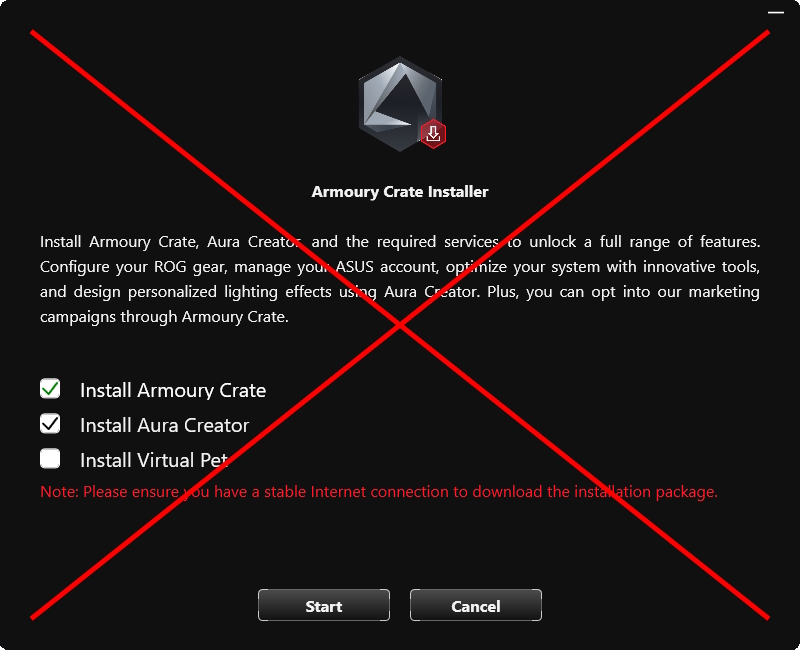
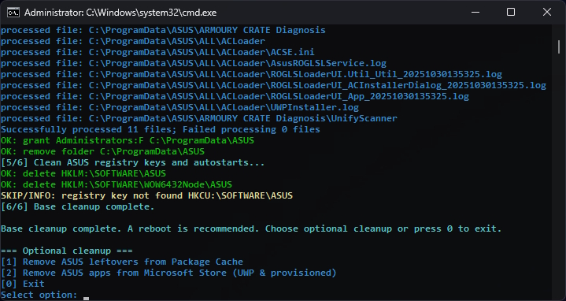

<h1 align="center">
Remove ASUS Bloatware & Leftovers
</h1>

A compact toolkit to **remove ASUS software and leftover components** (Armoury Crate, ASUS Update, Link, Aura/AAC, MyASUS, etc.).

⚠️ **The script does NOT run uninstallers for installed ASUS apps — you need to remove them manually.** It only cleans up the leftover junk: kills processes, disables services, removes scheduled tasks, deletes leftover folders, and cleans registry entries. Optional modules also handle **Package Cache** leftovers and **Microsoft Store (UWP + provisioned)** ASUS apps.

<p align="center">
  
</p>

## ✨ Features

- **Core cleanup** — kill processes, stop/disable/delete services, remove ASUS‑like scheduled tasks, delete folders with ACL fixes, and clean registry keys/autostarts.
- **Optional cleanup** — remove ASUS installers from *Package Cache* and uninstall ASUS Microsoft Store apps (for all users + provisioned).
- Clear console output.
- Safe to move between folders; paths aren’t hardcoded.

## 🖼 Screenshot

<p align="center">
  
</p>

## 🧩 Requirements

- Windows 10 / 11
- <a href="https://learn.microsoft.com/en-us/powershell/scripting/install/installing-powershell-on-windows" target="_blank" rel="noopener noreferrer">PowerShell</a> **5.1+** or **7+ (recommended)**
- **Administrator rights**

## 📁 Files

| File | Description |
|------|-------------|
| `remove_asus_bloat.ps1` | Core ASUS cleanup: processes → services → scheduled tasks (safe), folders (with ownership/ACL fix) → registry keys & Run entries. Includes optional modules for Package Cache and Microsoft Store ASUS apps. |
| `RUN_remove_asus_bloat.bat` | Batch wrapper that auto-elevates and runs the `remove_asus_bloat.ps1` script. |

> Keep all files in the same folder. The `.bat` wrapper run the corresponding `.ps1` from that folder, so you can move the folder anywhere.

## 🚀 Usage

Run:

```bat
RUN_remove_asus_bloat.bat
```

The script will:

- **[1/6] Kill** ASUS‑related processes (`ArmouryCrate*`, `ASUS*`, `MyASUS*`, `Aura*`, `Aac*`, `Link*`, …).
- **[2/6] Services:** stop, disable, and delete ASUS services where applicable.
- **[3/6] Scheduled tasks:** remove tasks whose names/paths look ASUS‑related using a **safe filter** (never touches `\\Microsoft\\…` and avoids false positives like `AsUser`).  
  Missing tasks are reported as `SKIP/INFO` rather than errors.
- **[4/6] Folders:** take ownership, grant access, and delete ASUS folders from **Program Files**, **Program Files (x86)**, **ProgramData**, and user **AppData** (`Roaming`/`Local`).
- **[5/6] Registry & autostarts:** remove ASUS registry keys and `Run` entries.
- **[6/6] Optional menu:** interactively run extra cleanup modules:
  - **Package Cache cleanup** — remove ASUS‑branded leftovers.
  - **Microsoft Store (UWP & provisioned)** — uninstall ASUS apps for all users and remove provisioned packages (when supported).

## ❗ Notes

- **32‑bit PowerShell warning:** Running a 32‑bit PowerShell on a 64‑bit OS can break registry/service access. Prefer a 64‑bit host (PowerShell 7 x64 `pwsh` or Windows PowerShell x64).
- **Safe task filter:** The script **never** removes tasks under `\\Microsoft\\…` and ignores misleading names like `AsUser`.
- **Permissions/ACLs:** Folder deletion includes ownership and ACL fixes to handle locked directories cleanly.
- **Provisioned packages:** Querying/removing provisioned packages requires Windows 10+ and admin rights; unsupported actions are downgraded to info messages.

## ❓ Troubleshooting

**Q:** I see `SKIP/INFO: cannot query provisioned packages`.  
**A:** Your Windows version/permissions may not expose them. It’s informational; core cleanup still runs.

**Q:** `ERROR: Access is denied` on services/registry/folders.  
**A:** You’re likely not elevated. Re‑run PowerShell **as Administrator**.

**Q:** Some ASUS apps reappear after a reboot.  
**A:** They may be provisioned/UWP apps or reinstalled by OEM updaters. Use the **Optional menu** to remove provisioned/UWP packages and clear Package Cache remnants.  
⚠️ Also note that most **ASUS devices (mice, keyboards, headsets, etc.) contain a built-in Armoury Crate installer** or trigger automatic download of the installer when connected.
In that case, the software will reappear every time the device is plugged in — simply **run the cleanup script again** after disconnecting or reinstalling the device.

**Q:** Can I undo the cleanup?  
**A:** No. This script **deletes** ASUS components rather than toggling them. If you need ASUS tools later, reinstall them from official sources.
